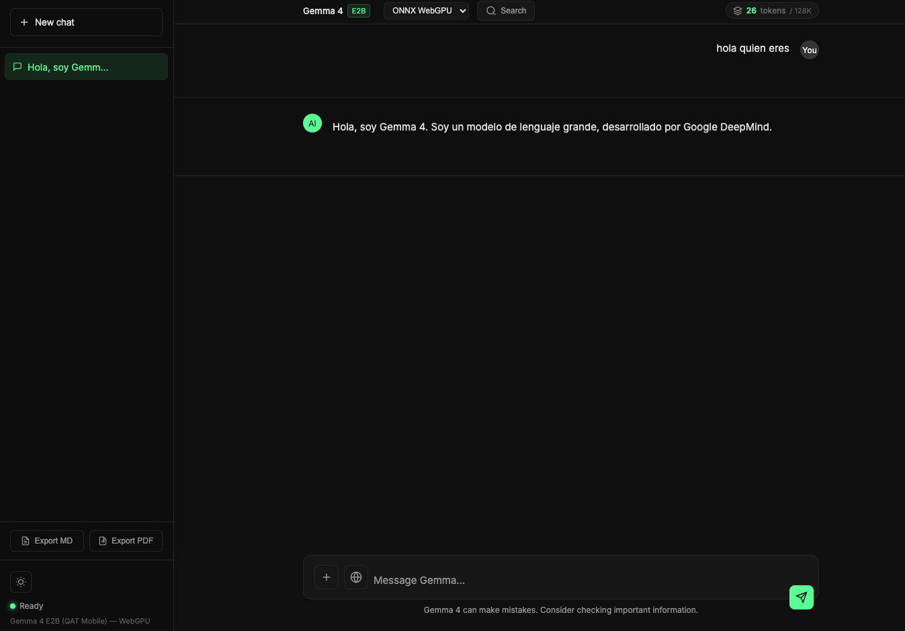

# Gemma 4 Chat - Local LLM with WebGPU

A chat application running **Google Gemma 4** directly in your browser using **WebGPU** acceleration. No server-side GPU required, no API keys, no cloud costs. The model runs entirely on your device.

Una aplicación de chat que ejecuta **Google Gemma 4** directamente en tu navegador usando aceleración **WebGPU**. Sin GPU en servidor, sin claves API, sin costes en la nube. El modelo corre completamente en tu dispositivo.



**Quick Overview / Resumen Rápido:**
```
git clone <repo> → docker compose up -d → http://localhost:8082
```
Or manually / O manualmente: `npm install` → `npm run download` → `npm start`

---

## 🤖 What is an LLM for WebGPU? / ¿Qué es un LLM para WebGPU?

This application runs a **Large Language Model (LLM)** - an AI trained to understand and generate human text - directly in your web browser using **WebGPU**, a modern browser API that enables GPU acceleration.

Esta aplicación ejecuta un **Modelo de Lenguaje Grande (LLM)** - una IA entrenada para entender y generar texto humano - directamente en tu navegador usando **WebGPU**, una API moderna que permite la aceleración por GPU.

### Key Concepts / Conceptos Clave

| English | Español |
|---------|---------|
| **LLM** = Large Language Model. AI trained on vast text data to understand context and generate responses. | **LLM** = Modelo de Lenguaje Grande. IA entrenada con enormes cantidades de texto para entender contexto y generar respuestas. |
| **WebGPU** = New browser standard that allows web apps to use your graphics card for computation, making AI run fast locally. | **WebGPU** = Nuevo estándar de navegador que permite a las apps web usar tu tarjeta gráfica para cómputo, haciendo que la IA corra rápido localmente. |
| **Gemma 4** = Google's open-source LLM (4 billion parameters), optimized to run on consumer devices. | **Gemma 4** = LLM de código abierto de Google (4 mil millones de parámetros), optimizado para ejecutarse en dispositivos de consumo. |

### Why WebGPU? / ¿Por qué WebGPU?

Traditional LLMs require powerful servers with expensive GPUs. **WebGPU changes this** by letting the model run on YOUR computer's GPU through the browser.

Los LLM tradicionales requieren servidores potentes con GPUs caras. **WebGPU cambia esto** permitiendo que el modelo corra en la GPU de TU computadora a través del navegador.

- ✅ **Privacy** / Privacidad: Your data never leaves your device / Tus datos nunca salen de tu dispositivo
- ✅ **Free** / Gratis: No API costs / Sin costes de API
- ✅ **Offline** / Sin conexión: Works without internet after download / Funciona sin internet tras descargar
- ✅ **Fast** / Rápido: Direct GPU acceleration / Aceleración GPU directa

---

## 🚀 Quick Start / Inicio Rápido

### Step 1: Clone the Repository / Paso 1: Clona el Repositorio

```bash
git clone <repository-url>
cd webgpu-chat
```

### Step 2: Install & Run / Paso 2: Instala y Ejecuta

Choose one method / Elige un método:

#### Option A: Docker (Recommended) / Opción A: Docker (Recomendado)

```bash
# Build and start / Construir e iniciar
docker compose up -d --build

# View logs / Ver logs
docker compose logs -f

# Or use aliases / O usa los alias:
# webml-start    → Start
# webml-restart  → Restart
# webml-stop     → Stop
# webml-logs     → View logs
```

Access at / Accede en: **http://localhost:8082**

#### Option B: Manual Installation / Opción B: Instalación Manual

```bash
# 1. Install Node.js dependencies / Instalar dependencias de Node.js
npm install

# 2. Download the model (~2.3GB, only once) / Descargar el modelo (~2.3GB, solo una vez)
npm run download

# 3. Start the server / Iniciar el servidor
npm start
```

Access at / Accede en: **http://localhost:3000**

---

## ✨ Features / Características

| English | Español |
|---------|---------|
| **ChatGPT-like interface** - Clean and professional design | **Interfaz tipo ChatGPT** - Diseño limpio y profesional |
| **Markdown rendering** - Code, tables, lists, etc. | **Markdown rendering** - Código, tablas, listas, etc. |
| **Chat persistence** - Saves history in localStorage | **Persistencia de chats** - Guarda historial en localStorage |
| **Local model support** - Download once, use forever | **Soporte modelo local** - Descarga una vez, usa siempre |
| **Auto detection** - Uses local if exists, CDN if not | **Detección automática** - Usa local si existe, CDN si no |
| **Docker support** - Easy restart with container | **Soporte Docker** - Reinicio fácil con contenedor |

---

## 📋 Requirements / Requisitos

| Requirement / Requisito | Why / Por qué |
|-------------------------|---------------|
| **Chrome 113+** or Edge 113+ | WebGPU is required to run the LLM locally / WebGPU es necesario para ejecutar el LLM localmente |
| Node.js 18+ | For manual installation / Para instalación manual |
| Docker & Docker Compose | For containerized setup / Para setup con contenedores |
| ~2.5 GB free space | The Gemma 4 model size / Tamaño del modelo Gemma 4 |

### What is WebGPU? / ¿Qué es WebGPU?

**WebGPU** is a modern web standard that gives browsers low-level access to your computer's GPU (graphics card). This app uses WebGPU to run the AI model directly on your hardware, achieving speeds impossible with pure JavaScript.

**WebGPU** es un estándar web moderno que da a los navegadores acceso de bajo nivel a la GPU de tu computadora. Esta app usa WebGPU para ejecutar el modelo de IA directamente en tu hardware, logrando velocidades imposibles con JavaScript puro.

---

## 🐳 Docker Usage / Uso con Docker

### Available Commands / Comandos Disponibles

Add to `~/.bash_profile` / Agregar a `~/.bash_profile`:

```bash
# WebML Docker aliases
alias webml-restart='cd /path/to/webml-webpage && docker compose restart && echo "WebML running at http://localhost:8082"'
alias webml-logs='cd /path/to/webml-webpage && docker compose logs -f'
alias webml-stop='cd /path/to/webml-webpage && docker compose down'
alias webml-start='cd /path/to/webml-webpage && docker compose up -d'
```

Then reload / Luego recarga:
```bash
source ~/.bash_profile
```

### Why Docker? / ¿Por qué Docker?

| English | Español |
|---------|---------|
- Easy restart: just run `webml-restart` | Reinicio fácil: solo ejecuta `webml-restart` |
- Port 8082 exposed and ready | Puerto 8082 expuesto y listo |
- Model files persist between restarts | Archivos del modelo persisten entre reinicios |
- No need to remember commands | No necesitas recordar comandos |

---

## 🔄 Usage Flow / Flujo de Uso

### First Time / Primera vez:

1. **Docker:** `docker compose up -d --build`
   - **Manual:** `npm install && npm run download`
2. Access / Accede http://localhost:8082 (Docker) or / o http://localhost:3000 (Manual)
3. Model loads from local server / El modelo carga desde el servidor local

### Subsequent Times / Veces siguientes:

1. **Docker:** `docker compose restart` or / o `webml-restart`
   - **Manual:** `npm start`
2. App auto-detects local model / La app detecta automáticamente el modelo local
3. Loads instantly from disk / Carga instantáneamente desde disco

---

## 📁 Project Structure / Estructura del Proyecto

```
webml-webpage/
├── docker-compose.yml     # Docker configuration / Configuración Docker
├── Dockerfile             # Docker image / Imagen Docker
├── server.js              # Express server / Servidor Express
├── package.json
├── download-model.js      # Download script / Script de descarga
├── model/                 # Downloaded model (2.3GB) / Modelo descargado
│   ├── model.safetensors  # Weights (~2.3GB) / Pesos
│   ├── tokenizer.json     # Tokenizer (~31MB) / Tokenizador
│   ├── chat_template.jinja
│   └── *.json             # Configs / Configuraciones
├── public/
│   └── js/
│       └── model.js       # Loads from local / Carga desde local
└── README.md
```

---

## 🔧 How It Works / Cómo Funciona

### Local Model Detection / Detección de Modelo Local

The server provides an endpoint `/api/model-status` that checks if model files exist in `./model/`.

El servidor proporciona un endpoint `/api/model-status` que verifica si los archivos del modelo existen en `./model/`.

The app queries this endpoint on load:
- **If exists** → Uses local server (fast, offline / rápido, offline)
- **If not** → Offers to download or uses CDN (slow, requires internet / lento, requiere internet)

La app consulta este endpoint al cargar:
- **Si existe** → Usa el servidor local (rápido, offline)
- **Si no** → Ofrece descargar o usa CDN (lento, requiere internet)

### Model Download / Descarga del Modelo

The script `download-model.js` downloads these files from HuggingFace:

El script `download-model.js` descarga estos archivos desde HuggingFace:

| File / Archivo | Size / Tamaño | Description / Descripción |
|----------------|---------------|---------------------------|
| `model.safetensors` | ~2.3 GB | Model weights / Pesos del modelo |
| `tokenizer.json` | ~32 MB | Tokenizer / Tokenizador |
| `chat_template.jinja` | ~17 KB | Chat template / Plantilla de chat |
| `config.json` | ~6 KB | Configuration / Configuración |
| `*.json` | ~1 KB | Additional configs / Configs adicionales |

**Total: ~2.5 GB**

### Local Loading / Carga Local

The key change in `public/js/model.js`:

El cambio clave en `public/js/model.js`:

```javascript
// Before / Antes (from CDN / desde CDN):
this.model = await Gemma4Mobile.load(null, { onProgress });

// After / Después (from local server / desde servidor local):
const localModelUrl = `${window.location.origin}/model`;
this.model = await Gemma4Mobile.load(localModelUrl, { onProgress });
```

---

## 🛠️ Available Scripts / Scripts Disponibles

| Command / Comando | Description / Descripción |
|-------------------|---------------------------|
| `npm start` | Start web server / Inicia el servidor web |
| `npm run download` | Download model (2.3GB) / Descarga el modelo |
| `npm run dev` | Alias of `npm start` / Alias de `npm start` |
| `docker compose up -d` | Start container / Inicia el contenedor |
| `docker compose restart` | Restart container / Reinicia el contenedor |
| `docker compose down` | Stop container / Detiene el contenedor |
| `docker compose logs -f` | View logs / Ver logs |

---

## 🐛 Troubleshooting / Solución de Problemas

### "Model not found" / "Modelo no encontrado"
- **EN:** Verify you ran `npm run download` or the model files exist in `./model/`
- **ES:** Verifica que ejecutaste `npm run download` o que los archivos del modelo existan en `./model/`
- Check `model.safetensors` is ~2.3GB / Revisa que `model.safetensors` tenga ~2.3GB

### "WebGPU not supported" / "WebGPU no soportado"
- Use Chrome 113+ or Edge 113+ / Usa Chrome 113+ o Edge 113+
- Check GPU supports WebGPU / Verifica que tu GPU soporte WebGPU
- Linux may need flags / En Linux, puede necesitar flags: `--enable-features=Vulkan`

### Download error / Error de descarga
- Check internet connection / Verifica tu conexión a internet
- Ensure enough free space / Asegúrate de tener espacio libre suficiente
- Model downloads from HuggingFace (requires internet) / El modelo se descarga desde HuggingFace (requiere internet)

### Docker issues / Problemas con Docker
- **Port in use / Puerto en uso:** Change port in `docker-compose.yml` / Cambia el puerto en `docker-compose.yml`
- **Permission denied / Permiso denegado:** Try with `sudo` / Prueba con `sudo`

---

## 📝 Technical Notes / Notas Técnicas

- The `Gemma4Mobile` model comes from HuggingFace CDN (`gemma-4-e2b.js`)
- The server acts as a proxy for model files
- Weights load via `fetch()` from local server
- The `gemma-4-e2b.js` bundle handles internal tensor loading
- Model files persist in Docker volume between restarts

- El modelo `Gemma4Mobile` viene del CDN de HuggingFace (`gemma-4-e2b.js`)
- El servidor actúa como proxy para los archivos del modelo
- Los pesos se cargan vía `fetch()` desde el servidor local
- El bundle de `gemma-4-e2b.js` maneja internamente la carga de tensores
- Los archivos del modelo persisten en el volumen Docker entre reinicios

---

## 📄 License / Licencia

This project is for personal use. The Gemma 4 model has Apache 2.0 license from Google.

Este proyecto es para uso personal. El modelo Gemma 4 tiene licencia Apache 2.0 de Google.

---

## 🔗 Links / Enlaces

- **Model / Modelo:** https://huggingface.co/google/gemma-4-E2B-it-qat-mobile-transformers
- **WebGPU Kernels:** https://huggingface.co/spaces/webml-community/gemma-4-webgpu-kernels
